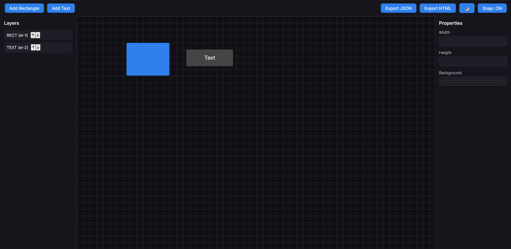
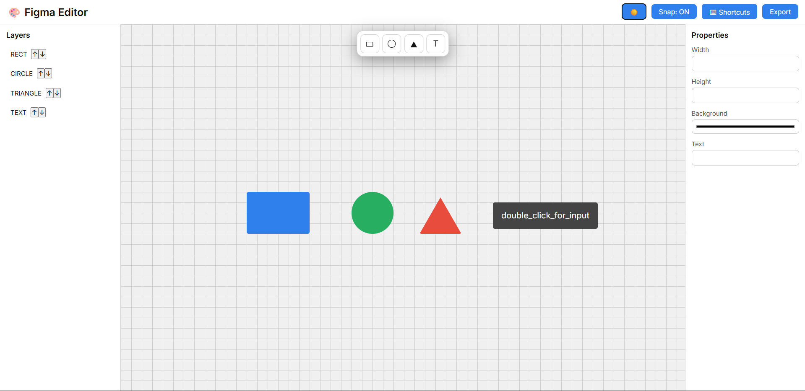

# 🎨 Figma Style Editor (Vanilla JavaScript)

A **Figma-inspired design editor** built using **pure HTML, CSS, and JavaScript**.  
No frameworks. No libraries. Only **core frontend fundamentals**.

This project is focused on understanding **how real design tools work internally** — drag, resize, rotate, layers, properties, and exports.

🔗 **GitHub Repository**  
👉 https://github.com/DhamechaKeval/figma_tool

---

### ✨ Key Highlights

- Built from scratch using **Vanilla JavaScript**
- Editor-style UI inspired by **Figma**
- Real-world **DOM + state management**
- Clean & readable code structure
- Fully functional without Canvas API

---

### 🚀 Features

#### 🧱 Canvas & Elements

- Add **Rectangle** elements
- Add **Text** elements
- Drag & drop elements freely
- Resize from all 4 corners
- Rotate elements using rotate handle
- Each element maintains its own position, size & rotation

#### 🗂 Layers Panel

- Automatic layers list generation
- Click layer to select element
- Move layers **Up / Down**
- Proper **z-index management**
- Active layer highlighting

#### 🎛 Properties Panel

- Change **Width**
- Change **Height**
- Change **Background Color**
- Edit **Text content**
- Live updates reflected on canvas

#### 🧲 Snap & Grid

- Grid based canvas background
- Optional snap logic
- Clean visual alignment experience
- Snap toggle supported

#### ⌨️ Keyboard Shortcuts

- `Delete` → Delete selected element
- `Arrow Keys` → Move element
- `Ctrl / Cmd + D` → Duplicate element
- Smooth keyboard interaction handling

#### 🎨 Theme Support

- Dark mode / Light mode
- Theme preference saved in `localStorage`
- Consistent UI colors across editor

#### 💾 State Persistence

- Canvas state saved in `localStorage`
- Reload page → design stays intact
- Elements, size, position, text all preserved

#### 📤 Export Options

- **Export JSON** (design data)
- **Export HTML** (final layout)
- Clean and usable exported HTML file

---

#### 🛠 Tech Stack

- **HTML5**
- **CSS3**
- **JavaScript (ES6+)**
- No external libraries
- No frameworks (React / Vue not used intentionally)

> This project is built without frameworks to showcase **strong JavaScript fundamentals**.

---

#### 📁 Project Structure

```bash
figma_tool/
│
├── index.html # Main editor layout
├── style.css # UI styling (Dark / Light themes)
├── script.js # Core editor logic
└── README.md # Project documentation
```

---

#### 🧠 What This Project Demonstrates

- Deep understanding of **DOM manipulation**
- Mouse & keyboard event handling
- Editor-style coordinate calculations
- State management without frameworks
- Clean separation of logic
- Real-world UI/UX problem solving

This is **not a basic CRUD project** —  
this is a **logic-heavy editor system**.

---

### 🧭 How to Use it (Guide)

Follow these simple steps to use the Figma Style Editor:

1️⃣ **Open the Project**

- Download or clone the repository

  ```bash
  git clone https://github.com/DhamechaKeval/figma_tool
  Open index.html in your browser
  ```

2️⃣ **Add Elements**

- **Add Rectangle** par click karo → rectangle element canvas par add hoga
- **Add Text** par click karo → text element canvas par add hoga
- New elements automatically **Layers Panel** me show honge

3️⃣ **Select & Move**

- Element par click karo → element select ho jayega
- Mouse se drag karke element move karo
- **Arrow keys** ka use karke fine movement karo

4️⃣ **Resize & Rotate**

- Selected element ke **corners** se resize karo
- Upar wale **rotate handle** se element rotate karo

5️⃣ **Edit Text**

- Text element par **double click** karo
- Direct canvas par text edit karo
- **Enter** press karne ya blur hone par text save ho jata hai

6️⃣ **Use Properties Panel**

- Width / Height manually change karo
- Background color update karo
- Text content yahin se bhi edit ho sakta hai

7️⃣ **Manage Layers**

- Layers panel se element select karo
- **↑ / ↓ buttons** se layer order change karo
- Top layer hamesha front me rahegi

8️⃣ **Keyboard Shortcuts**

- **Delete** → Selected element delete
- **Arrow Keys** → Move element
- **Ctrl / Cmd + D** → Duplicate element

9️⃣ **Theme Toggle**

- 🌙 / ☀️ button se **Dark / Light theme** switch karo
- Theme preference automatically save ho jati hai

1️⃣0️⃣ **Export Your Design**

- **Export JSON** → design data Download in JSON formate
- **Export HTML** → final layout html file Genrate

1️⃣1️⃣ **Auto Save**

- Your design remains safe even after refreshing the page
- The editor state is automatically saved in **localStorage**

---

#### 📸 Preview

> Dark Theme Preview



> Light Theme Preview


